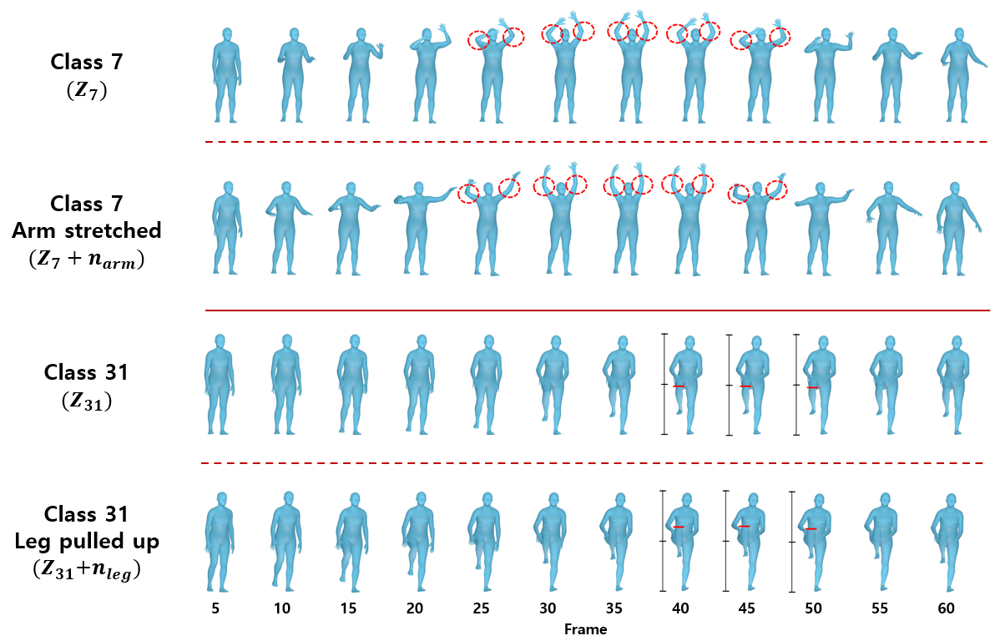

# 3D Human Action Control in Latent Space of Transformer VAE
[ProjectPage](https://anonymous.4open.science/w/Motion_Control-3229/)

**Figure:** *Control human motion directly from latent space of Transformer-VAE.*

> **3D Human Action Control in Latent Space of Transformer VAE**  

In this repository, we present method for **controlling human motion** from previously developed Transformer-VAE model ([ACTOR](https://github.com/Mathux/ACTOR)). With this method you can control human motion through discovered direction using **low-rank factorization**. We also proposed scheduling scheme, and data augmetation for learning latent space with more active units. We show some interesting results below.

## Installation
The environment for this repository is the same as the [ACTOR](https://github.com/Mathux/ACTOR). Please refer to README in the ACTOR](https://github.com/Mathux/ACTOR) repository for the environment settings.

## Usage

## References
We referenced the repos below for the code.

* [ACTOR](https://github.com/Mathux/ACTOR)
* [LowRankGAN](https://github.com/zhujiapeng/LowRankGAN)

## License
This code is distributed under an [MIT LICENSE](LICENSE).

Note that our code depends on other libraries, including SMPL, SMPL-X, PyTorch3D, and uses datasets which each have their own respective licenses that must also be followed.
